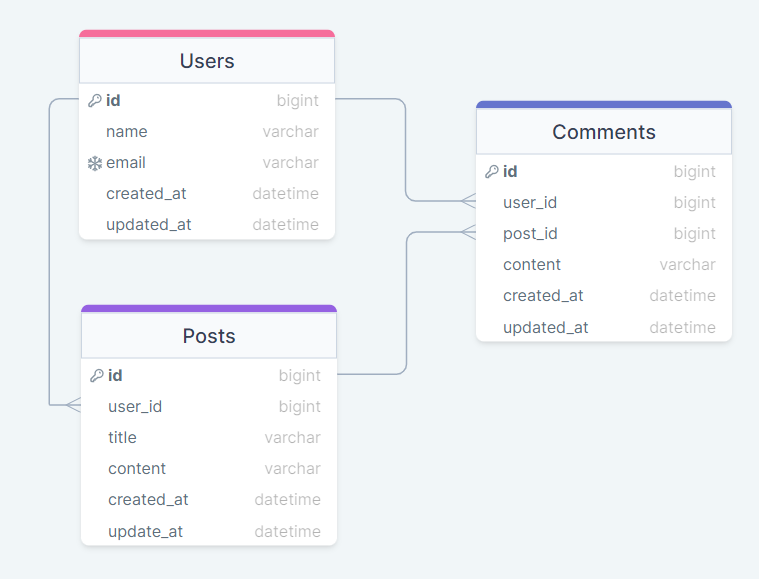

# 👨‍💻‍Sobre o projeto

Esse projeto foi feito com o intuito de exercitar minhas habilidades com Java e Spring.

Através dessa API é possível cadastrar usuários, fazer posts e também comentar em postagens.

## 💿Como rodar na sua máquina

### Pré-requisitos

- **Git**;
- **Docker + Docker-Compose (caso queira utilizar Docker)**;
- **Java 17 (caso queira utilizar o Maven)**

<details>
    <summary><b>🐳Utilizando Docker</b></summary>

```shell
# Clone o repositório na sua máquina
$ git clone https://github.com/lleonardus/social-media.git

# Abra a pasta do projeto
$ cd social-media

# Inicie o projeto usando Docker
$ docker-compose up
```

Após esse processo, a API vai estar rodando em **http://localhost:8080**
e a documentação estará disponível em **http://localhost:8080/swagger-ui.html**.

</details>

<details>
    <summary><b>♨️Utilizando Maven</b></summary>

```shell
# Clone o repositório na sua máquina
$ git clone https://github.com/lleonardus/social-media.git

# Abra a pasta do projeto
$ cd social-media

# Inicie o projeto usando Maven
$ ./mvnw spring-boot:run
```

Após esse processo, a API vai estar rodando em **http://localhost:8080**,
a documentação estará disponível em **http://localhost:8080/swagger-ui.html**
e o banco de dados (H2 database) poderá ser acessado em **http://localhost:8080/h2-console/**

</details>

## 💾Banco de Dados



Dentro de `src/main/resources` coloquei um arquivo chamado **data.sql** que já contém alguns dados
para testar a API. Caso queira fazer alguma alteração nesses dados, basta alterar o arquivo manualmente.

## 🎯Endpoints

### 👨‍👩‍👧‍👦Users

- **GET** `/social-media/users`: Retorna uma lista com todos os usuários.
- **GET** `/social-media/users/{userId}`: Retorna um usuário.
- **POST** `/social-media/users`: Registra um novo usuário.
- **PUT** `/social-media/users/{userId}`: Atualiza um usuário.
- **DELETE** `/social-media/users/{userId}`: Deleta um usuário.
- **GET** `/social-media/users/{userId}/posts`: Retorna uma lista com todos os posts de um usuário.
- **POST** `/social-media/users/{userId}/posts`: Faz com que um usuário crie um post.
- **GET** `/social-media/users/{userId}/comments`: Retorna uma lista com todos os comentários de um usuário.
- **POST** `/social-media/users/{userId}/{postId}/comment`: Faz com que um usuário faça um comentário em um post.

## 🧰Ferramentas Utilizadas

- Java 17
- Spring Boot
- Spring Web
- Spring Data JPA
- H2 Database
- SpringDoc OpenAPI
- Lombok
- Model Mapper